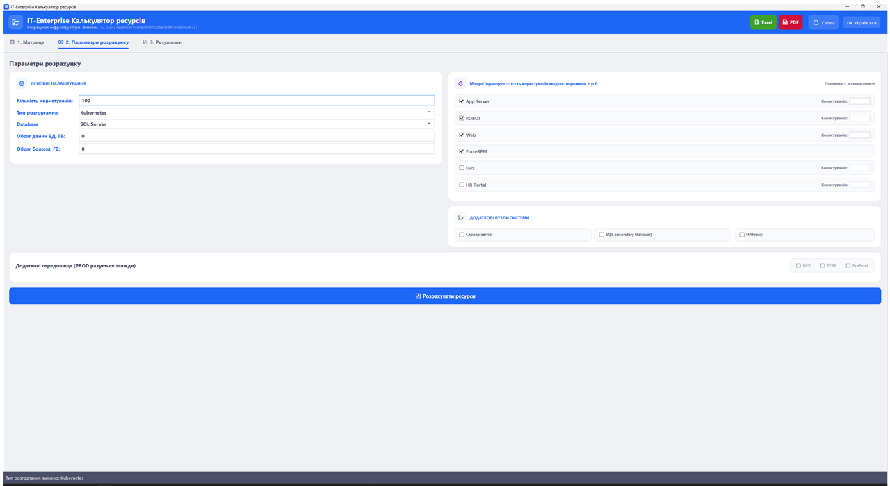

<div align="center">

# IT-Enterprise Resource Calculator — Source Code

[](https://github.com/ajjs1ajjs/Calculator-servers)
[](LICENSE)

> **Це репозиторій з вихідним кодом IT-Enterprise Resource Calculator.**
> Готовий продукт деплоїться в: **https://github.com/ajjs1ajjs/Calculator-servers**
> Офіційний сайт: **https://ajjs1ajjs.github.io/Calculator-servers/**


# 🧮 IT-Enterprise Resource Calculator

**Калькулятор ресурсів IT-інфраструктури на основі матриці сайзингу**
[](https://github.com/ajjs1ajjs/Calculator-servers/releases/latest)
[](https://github.com/ajjs1ajjs/Calculator-servers/releases)
[](https://github.com/ajjs1ajjs/Calculator-servers/actions)
[](https://github.com/ajjs1ajjs/Calculator-servers/actions)
[]()
[]()
[](LICENSE)

**WPF · MVVM · .NET 10** — десктоп-застосунок для автоматизованого розрахунку ресурсів IT-інфраструктури.
Працює на **Windows 10/11**.

<a href="https://github.com/ajjs1ajjs/Calculator-servers/releases/latest"></a>

</div>

---

## ✨ Можливості

| | |
|---|---|
| 🧮 **3 кроки** | «Матриця» → «Параметри розрахунку» → «Результати». |
| 🛠️ **Редагування матриці** | Усі діапазони (SQL/Postgres/Oracle/App/Web), компоненти та формули модулів, вузли інфраструктури — змінюються в UI та зберігаються в `matrix.json` без передеплою. |
| 🔐 **Захист матриці** | Зміна чутливих даних (діапазони, формули, вузли) потребує пароля; при забутому паролі — контакти розробника для відновлення доступу. |
| ⚙️ **Налаштування рушія** | Константи розрахунку (SmartID, IOPS-профілі, ліміти SQL, pagefile) редагуються через матрицю. |
| 🖥️ **3 режими розгортання** | Kubernetes, Windows та Hybrid (app/web — Windows-VM, ForceBPM та інші — K8s, БД — Windows). |
| 🌍 **4 середовища** | PROD (завжди), DEV, TEST та PreProd — з порівняльною таблицею. |
| 🗄️ **3 типи СУБД** | MS SQL Server, PostgreSQL, Oracle 19c. |
| ⚡ **Профіль навантаження** | Єдиний продуктивний профіль (Performance). |
| 💾 **Вимоги до дисків** | Окрема розкладка для БД (OS / Logs+TempDB / Data / Content) та файл підкачки для app/web-вузлів. |
| 🧩 **Опціональні вузли** | Сервер звітів, SQL Secondary (failover) та HAProxy з режимом High Availability (2 вузли, keepalived/VRRP, спільний VIP). |
| 📤 **Експорт звіту** | Excel (.xlsx, для тендерів), XML та HTML. |
| 🕘 **Історія розрахунків** | Останні 20 розрахунків зберігаються локально. |
| 🌐 **Локалізація** | Українська та англійська мови. |

---

## 📸 Інтерфейс

<div align="center">



</div>

---

## 🚀 Швидкий старт

### З вихідного коду

```bash
dotnet run --project ResourceCalculator/ResourceCalculator.csproj
```

### Збірка та тести

```bash
dotnet build ResourceCalculator.slnx -c Release
dotnet test  ResourceCalculator.slnx -c Release
```

> Потрібен [.NET SDK 10](https://dotnet.microsoft.com/download/dotnet/10.0) (версія зафіксована у [`global.json`](global.json)).

### Публікація

```bash
# Windows (WPF, win-x64, self-contained, ~50 МБ, один exe)
dotnet publish ResourceCalculator/ResourceCalculator.csproj -c Release --output publish
```

---

## 📦 Розповсюдження

| Платформа | Артефакт | Файл | Примітка |
|---|---|---|---|
| **Windows** | Портативний `.exe` (WPF) | `ITE.ResourceCalculator.exe` | Self-contained, один файл, ~70 МБ. **Вбудоване автоматичне оновлення** з прогресом всередині програми. |

> Єдиний артефакт релізу. Публікується автоматично в GitHub Release при push тегу `vX.Y.Z`
> ([`release.yml`](.github/workflows/release.yml)) — вручну нічого збирати не треба.
> Поточна версія показана в шапці вікна (поруч із підзаголовком).

---

## 🏷️ Версійність (обов'язково для кожного релізу)

Вбудоване оновлення покладається на версію: `UpdateCheckService` порівнює її з тегом останнього GitHub Release.

- **Єдине джерело версії** — `AppVersion` у [`Directory.Build.props`](Directory.Build.props).
- **Перед кожним релізом бампати `AppVersion`.** Інакше `UpdateCheckService` не побачить новий реліз, а тег, який уже існує, вдруге не запушиться.

### 🚀 Публікація релізу

Реліз робить GitHub Actions — локально нічого збирати не потрібно:

```bash
# 1. Бампнути AppVersion у Directory.Build.props
# 2. Закомітити й запушити
git add <файли змін> && git commit -m "..." && git push origin main

# 3. Поставити тег — це і є реліз
git tag v2.4.12 && git push origin v2.4.12
```

Push тегу `v*` запускає [`release.yml`](.github/workflows/release.yml): build → test → publish
self-contained exe → створення GitHub Release з артефактом `ITE.ResourceCalculator.exe`.

---

## 🧩 Технології

**Платформа:** C# / WPF (Windows) · .NET 10 · MVVM
**Архітектура:** Microsoft.Extensions.DependencyInjection (DI-контейнер), `ResourceCalculator.Core` (спільна логіка)
**Excel/PDF:** EPPlus 7.6 / QuestPDF 2026.6
**Тести:** xUnit (131 тест) + збір звітів покриття (ReportGenerator)

---

## 📁 Структура проєкту

```
ResourceCalculator.slnx
├── Directory.Build.props            # єдине джерело версії (AppVersion)
├── ResourceCalculator/              # WPF-застосунок (Windows) — лише UI
│   ├── Views/                       # XAML-вкладки інтерфейсу
│   ├── Dialogs/                     # WpfDialogService (діалоги, вибір файлу)
│   ├── Converters/                  # конвертери прив'язок XAML
│   ├── Localization/                # WPF-обгортка локалізації
│   └── Themes/                      # теми оформлення
├── ResourceCalculator.Core/         # уся логіка, незалежна від UI
│   ├── Services/                    # рушій сайзингу, експорт, валідація, оновлення
│   ├── ViewModels/                  # ViewModel'и MVVM
│   ├── Models/                      # моделі даних (вузли, діапазони, модулі)
│   ├── Interfaces/                  # абстракції UI-діалогів і сервісів
│   ├── Data/                        # матриця сайзингу за замовчуванням
│   └── Localization/                # рядки інтерфейсу (uk/en)
├── ResourceCalculator.Tests/        # модульні тести (xUnit, 130)
├── .github/workflows/               # CI + реліз на push тегу
├── docs/                            # банер та скріншоти
└── index.html                       # лендінг GitHub Pages
```

---

## 📄 Історія змін

Повний журнал змін — у [CHANGELOG.md](CHANGELOG.md).

---

## 📜 Ліцензія

[MIT](LICENSE) © [ajjs1ajjs](https://github.com/ajjs1ajjs)

---

<div align="center">

**IT-Enterprise Resource Calculator** © [ajjs1ajjs](https://github.com/ajjs1ajjs)

⭐ Сподобалось? Поставте зірочку!

</div>
