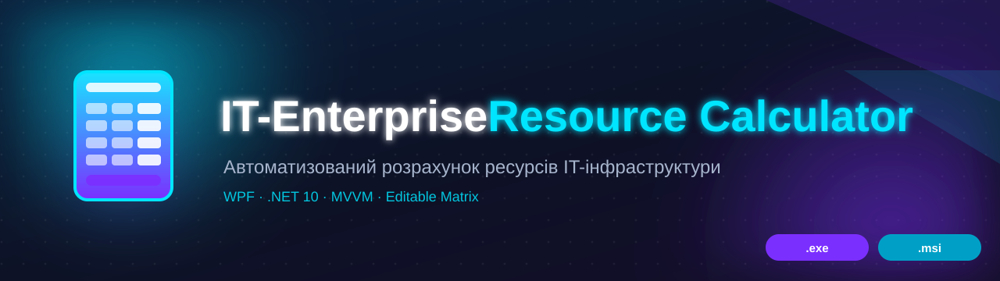
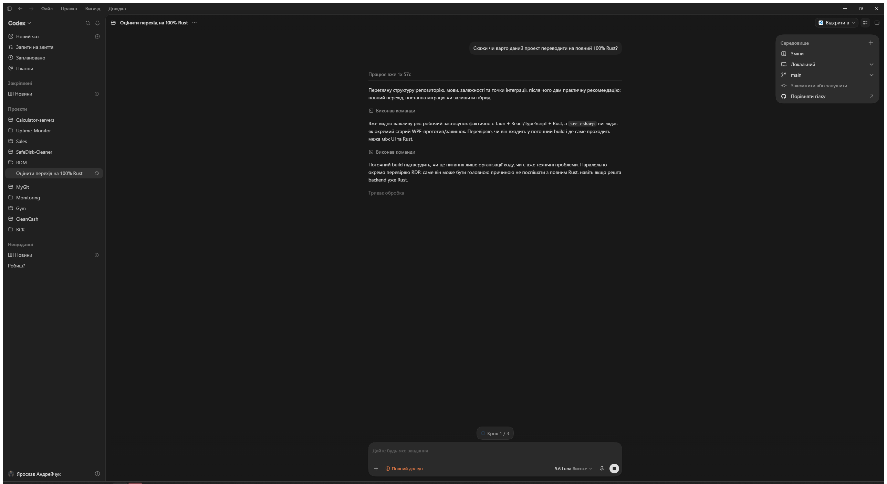

<div align="center">

# 🧮 IT-Enterprise Resource Calculator

**Калькулятор ресурсів IT-інфраструктури на основі матриці сайзингу**



[](https://github.com/ajjs1ajjs/Calculator-servers/releases/latest)
[](https://github.com/ajjs1ajjs/Calculator-servers/releases)
[](https://github.com/ajjs1ajjs/Calculator-servers/actions)
[](https://github.com/ajjs1ajjs/Calculator-servers/actions)
[]()
[]()
[](https://github.com/ajjs1ajjs/Calculator-servers/actions)

**WPF · MVVM · .NET 10** — десктоп-застосунок для автоматизованого розрахунку ресурсів IT-інфраструктури.

<a href="https://github.com/ajjs1ajjs/Calculator-servers/releases/latest"></a>

</div>

---

## ✨ Можливості

| | |
|---|---|
| 🖥️ **3 режими розгортання** | Kubernetes, Windows та Hybrid (app/web — Windows-VM, ForceBPM та інші — K8s, БД — Windows). |
| 🌍 **4 середовища** | PROD (завжди), DEV, TEST та PreProd — з порівняльною таблицею. |
| 🗄️ **3 типи СУБД** | MS SQL Server, PostgreSQL, Oracle 19c. |
| ⚡ **Профілі навантаження** | Стандарт (Basic) та Документообіг (Performance) — з порівнянням. |
| 💾 **Вимоги до дисків** | Окрема розкладка для БД (OS / Logs+TempDB / Data / Content) та файл підкачки для app/web-вузлів. |
| 🧩 **Опціональні вузли** | Сервер звітів, SQL Secondary (failover) та HAProxy з режимом High Availability (2 вузли, keepalived/VRRP, спільний VIP). |
| 📥 **Імпорт Excel** | Завантаження та редагування матриці сайзингу. |
| 📤 **Експорт звіту** | Excel (.xlsx, для тендерів), XML (для імпорту) та HTML. |
| 🕘 **Історія розрахунків** | Останні 20 розрахунків зберігаються локально. |
| 🌐 **Локалізація** | Українська та англійська мови. |

---

## 📸 Інтерфейс

<div align="center">



</div>

---

## 🚀 Швидкий старт

### З вихідного коду

```bash
dotnet run --project AIResourceCalculator/AIResourceCalculator.csproj
```

### Збірка та тести

```bash
dotnet build AIResourceCalculator.slnx -c Release
dotnet test  AIResourceCalculator.slnx -c Release
```

> Потрібен [.NET SDK 10](https://dotnet.microsoft.com/download/dotnet/10.0) (версія зафіксована у [`global.json`](global.json)).

### Публікація self-contained exe

```bash
dotnet publish AIResourceCalculator/AIResourceCalculator.csproj -c Release --output publish
```

---

## 📦 Розповсюдження

Є два способи постачання користувачам:

| | Портативний `.exe` | MSI-інсталятор |
|---|---|---|
| Файл | `publish/ITE.ResourceCalculator.exe` | `publish/ITE.ResourceCalculator.msi` |
| Оновлення | Перевірка версії з GitHub Release у фоні ([`UpdateCheckService`](AIResourceCalculator/Services/UpdateCheckService.cs)) | Класичний Windows Installer upgrade (за `UpgradeCode`, [`Package.wxs`](AIResourceCalculator.Installer/Package.wxs)) |
| Автоматичне | Ні — заміна вручну | Ні — користувач сам запускає новий MSI (або GPO/SCCM) |

Поточна версія показана в шапці вікна (поруч із підзаголовком).

### 🔏 Цифровий підпис exe

[`sign.ps1`](sign.ps1) підписує опублікований `publish\AIResourceCalculator.exe`:

```powershell
# Самопідписаний сертифікат (для внутрішнього використання)
./sign.ps1

# Корпоративний / придбаний сертифікат — підпис, якому довірятимуть інші ПК
./sign.ps1 -PfxPath C:\certs\company.pfx -PfxPassword (Read-Host -AsSecureString)
```

> Самопідписаний підпис вбудовується у файл, але на чужих ПК SmartScreen усе одно
> попереджатиме, доки сертифікат не додано в їхній Trusted Root (`-TrustLocally` додає
> його лише на поточну машину). Для зникнення попереджень потрібен сертифікат від CA.

---

## 🏷️ Версійність (обов'язково для кожного релізу)

Обидва канали оновлення покладаються на версію: `UpdateCheckService` порівнює її з тегом
GitHub Release, а MSI — `ProductVersion` для upgrade/downgrade-логіки:

- **Єдине джерело версії** — `AppVersion` у [`Directory.Build.props`](Directory.Build.props).
- **Перед кожним релізом бампати `AppVersion`.** Інакше `UpdateCheckService` не побачить
  новий реліз, а публікація тегу, який уже існує, — помилка.
- [`release.ps1`](release.ps1) примусово перевіряє це: зупиняє реліз, якщо тег `vX.Y.Z`
  для поточної `AppVersion` вже є локально або на origin.

### 🚀 Публікація релізу

```powershell
git add <файли змін> && git commit -m "..."   # спершу закомітити зміни вручну
./release.ps1 -ReleaseNotes "Опис змін..."
```

Скрипт: перевіряє версійність → зупиняється при незакомічених/невідстежуваних змінах →
білдить і тестує → публікує й підписує exe → збирає MSI → пушить і тегує → створює
GitHub Release з обома артефактами (`.exe` і `.msi`).

---

## 🧩 Технології

**Платформа:** C# / WPF · .NET 10 · MVVM
**Архітектура:** Microsoft.Extensions.DependencyInjection (DI-контейнер)
**Excel:** EPPlus 7.6 (читання та експорт)
**Тести:** xUnit (108 тестів) + збір звітів покриття (ReportGenerator)

---

## 📁 Структура проєкту

```
Calculator-servers.slnx
├── Directory.Build.props            # спільна версія (AppVersion)
├── AIResourceCalculator/            # WPF-застосунок
│   ├── Models/                      # моделі даних (вузли, діапазони, модулі)
│   ├── Services/                    # рушій сайзингу, експорт, валідація, диски
│   ├── ViewModels/                  # ViewModel'и MVVM
│   ├── Views/                       # XAML-вкладки інтерфейсу
│   ├── Data/                        # матриця сайзингу за замовчуванням, імпорт Excel
│   ├── Localization/                # рядки інтерфейсу (uk/en)
│   └── Themes/                      # теми оформлення
├── AIResourceCalculator.Tests/      # модульні тести (xUnit, 108)
├── AIResourceCalculator.Installer/  # WiX-проєкт MSI-інсталятора (Package.wxs)
├── docs/                            # банер та скріншоти
├── release.ps1                      # публікація GitHub Release (exe + msi)
└── sign.ps1                         # цифровий підпис exe
```

---

## 📄 Історія змін

Повний журнал змін — у [CHANGELOG.md](CHANGELOG.md).

---

<div align="center">

**IT-Enterprise Resource Calculator** © [ajjs1ajjs](https://github.com/ajjs1ajjs)

⭐ Сподобалось? Поставте зірочку!

</div>
